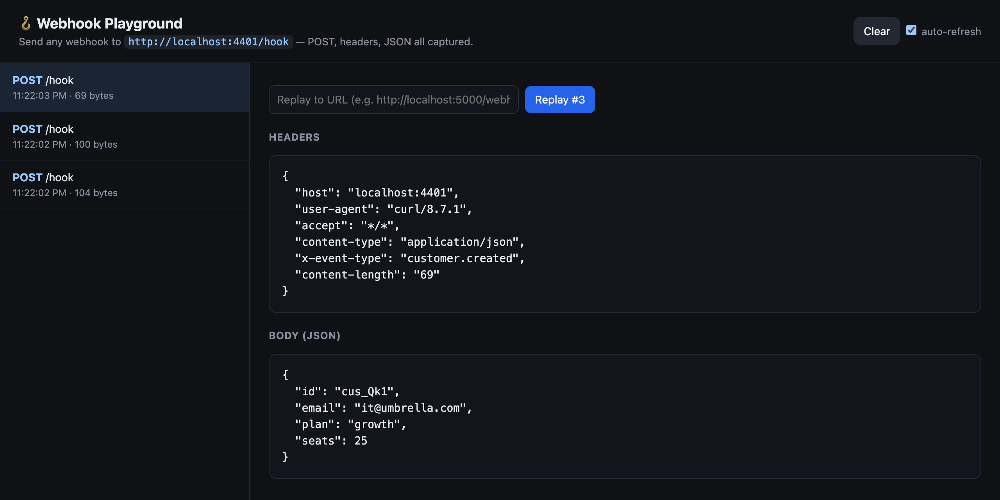

# 🪝 Webhook Playground

A **zero-dependency** webhook receiver. Point any webhook source (Stripe, GitHub, Twilio, your own product) at it, and **capture every request** — method, headers, and body — in a live UI. Then **replay** any captured webhook to a local target URL.

Pure Node.js (built-in `http` + `fetch`). No frameworks, no `npm install`.



> Why this exists: webhooks are in almost every SE demo and integration call ("when X happens in our system, we POST to your endpoint…"). Being able to *show* the exact payload arriving — and replay it on demand — is a small superpower in a technical sale. The zero-dependency build also signals clean Node fundamentals.

---

## Quick start

```bash
git clone https://github.com/srathish/webhook-playground
cd webhook-playground
node src/server.js
# → open http://localhost:4000
# → send webhooks to http://localhost:4000/hook
```

No install step.

### Try it

```bash
# Send a sample webhook:
curl -X POST http://localhost:4000/hook \
  -H "content-type: application/json" \
  -H "x-event-type: payment.succeeded" \
  -d '{"id":"evt_123","amount":4200,"currency":"usd"}'
```

It appears instantly in the UI with headers + pretty-printed JSON. Paste a target URL and hit **Replay** to forward it to your app under development.

---

## What it does

```
Stripe / GitHub / Twilio / your app
            │  POST
            ▼
   /hook  ──►  captured (method, headers, body)  ──►  live UI
                                                       │  Replay ▸
                                                       ▼
                                              your local endpoint
```

- Captures **any method** and path under `/hook`.
- Pretty-prints JSON bodies; shows raw for non-JSON.
- Keeps the last 100 events in memory.
- **Replay** forwards the exact payload + headers to any URL you specify.
- JSON API: `GET /_events`, `POST /_clear`, `POST /_replay`.

- [`src/server.js`](src/server.js) — the whole backend (~110 lines, no deps)
- [`public/index.html`](public/index.html) — the inspector UI

## Roadmap

- Signature verification helpers (Stripe `Stripe-Signature`, GitHub `X-Hub-Signature-256`)
- Persist events across restarts
- Public tunneling instructions (so real SaaS webhooks can reach localhost)
- Edit-then-replay (tweak the payload before forwarding)

## License

MIT
